# Automated YouTube Clone Deployment Using Azure DevOps CI/CD Pipelines

This project focuses on creating a YouTube-like web application and leveraging Azure DevOps for end-to-end automation of the development lifecycle through a Continuous Integration/Continuous Deployment (CI/CD) pipeline. The main objective is to streamline the entire process of code integration, testing, and deployment using Azure DevOps services, ensuring fast, reliable, and consistent delivery of the application to the cloud.
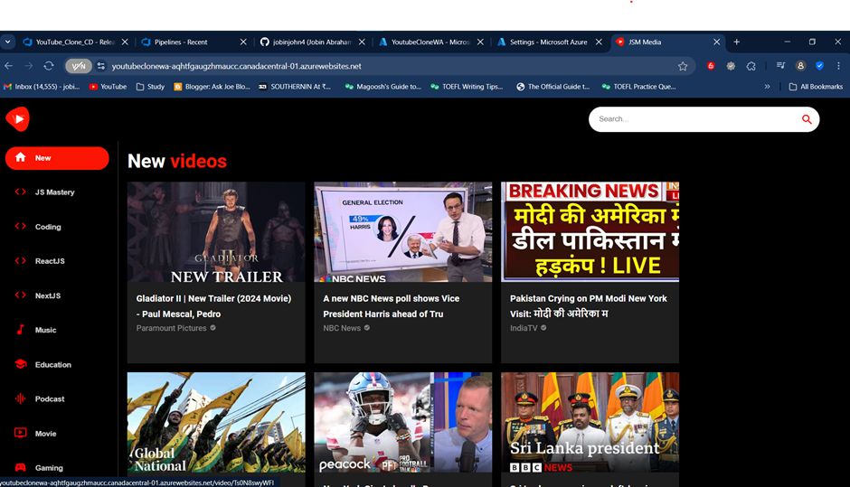
## Azure Repos
To clone the YouTube Git repository into a local directory, first, initialize a local Git repository by running git init. Next, use the command git clone https://github.com/piyushsachdeva/Youtube_Clone Azure_devops_Youtubeclone to clone the repository into a directory named Azure_devops_Youtubeclone on your local machine. This will create a local copy of the repository in the specified folder, allow to work on the project files and manage version control.

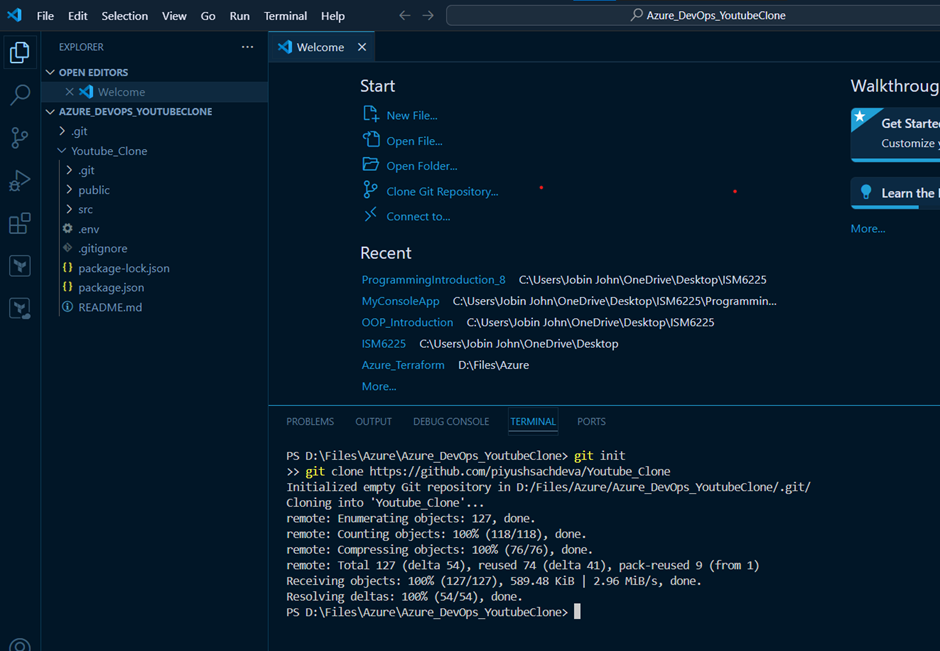

## Created a New Azure DevOps Project: YouTube Clone
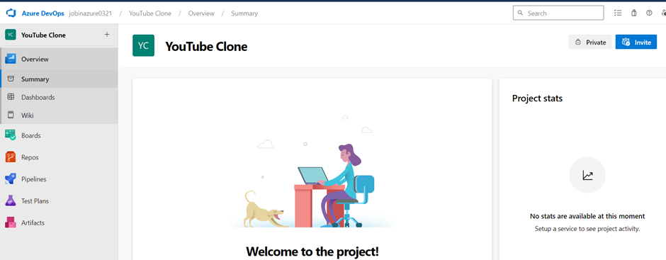
## Pushing Existing Local Repository Code to Azure Repos
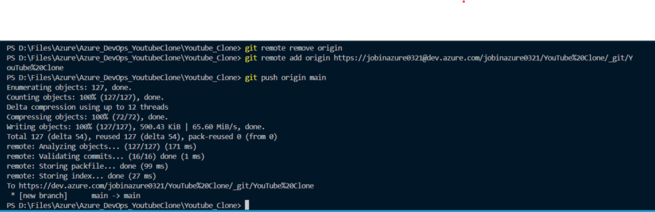
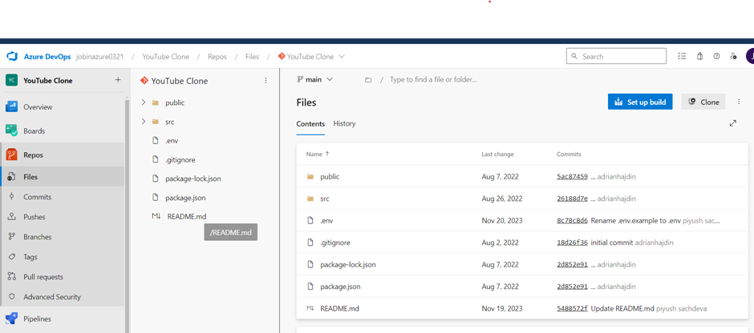
## Creating an Azure App Service on Azure: A PaaS Solution for Simplified Application Deployment
Creating an Azure App Service offers a Platform as a Service (PaaS) solution that simplifies application deployment by handling infrastructure, connectivity, and updates. Developers can focus on building applications while the cloud provider ensures high availability, scalability, and security, facilitating seamless integration with other Azure services and continuous deployment.

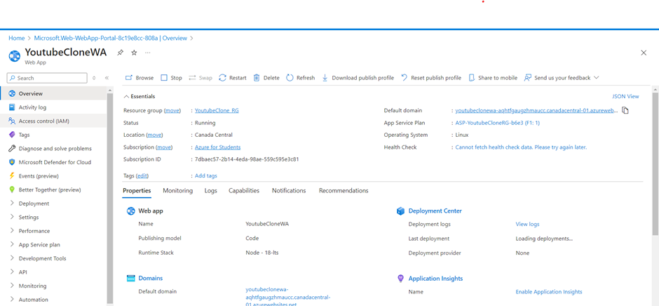
## Creating a Build Pipeline in Azure DevOps Using the Classic Pipeline Editor
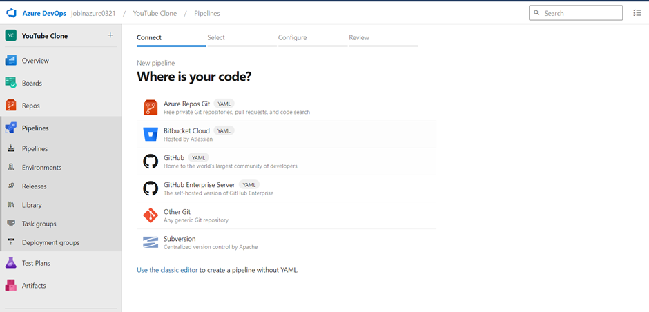
## Creating build pipeline by utilizing empty jobs

## Adding npm install and npm build in Azure DevOps Build Pipeline
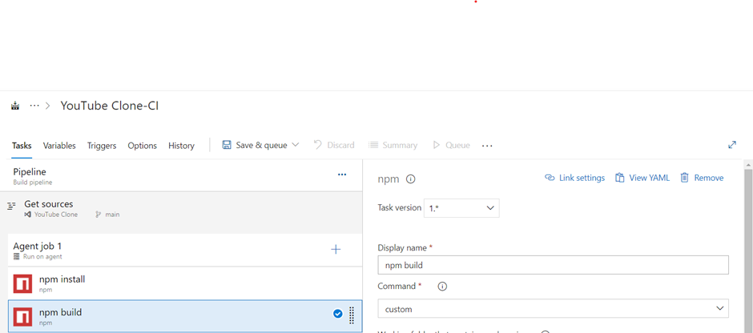
## Adding task Publish Artifact : Drop
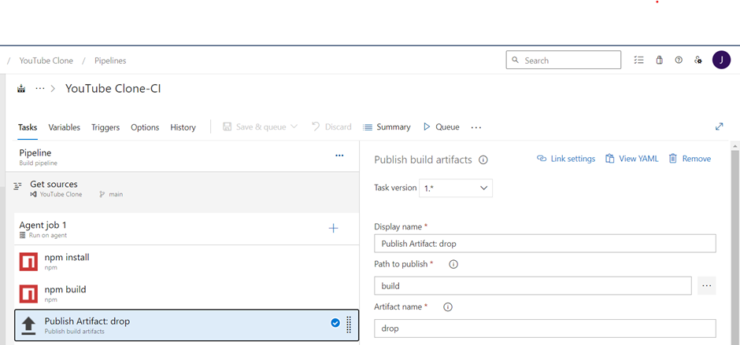
## Creating release pipeline
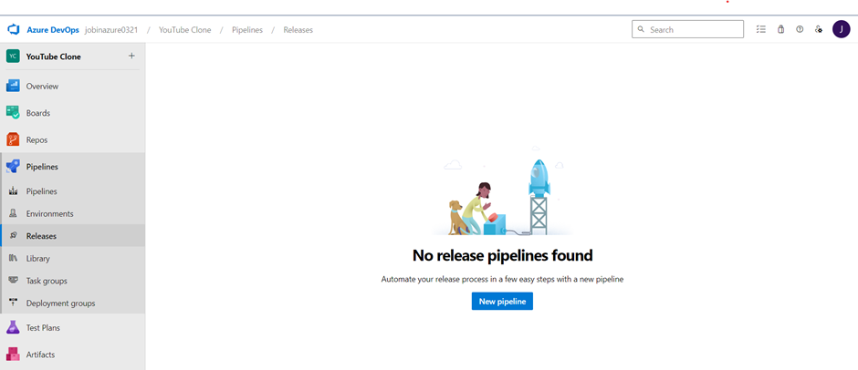
## Adding task in release pipeline : deploy azure app service
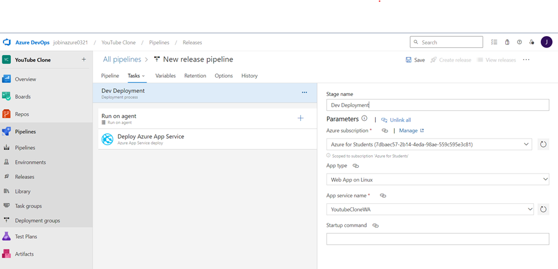
## Adding Artifact
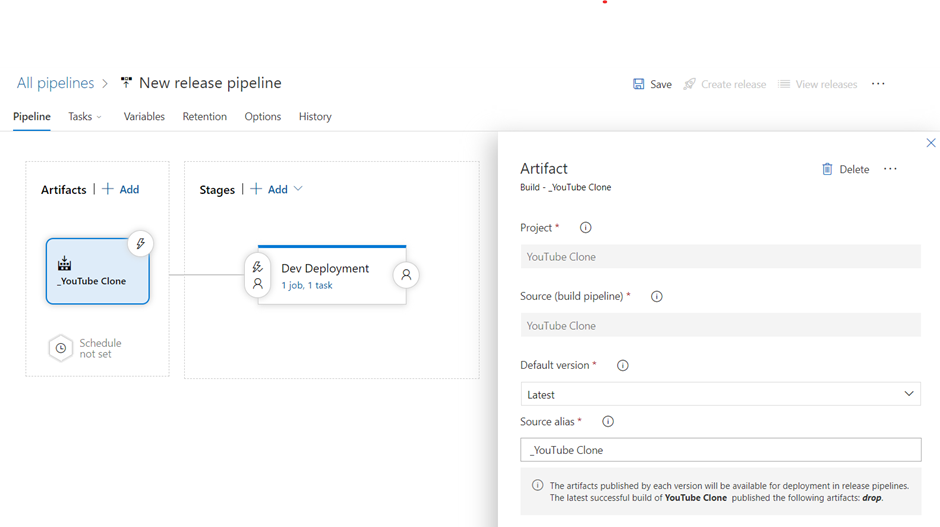
## Enabling pull request trigger and selecting the build branch
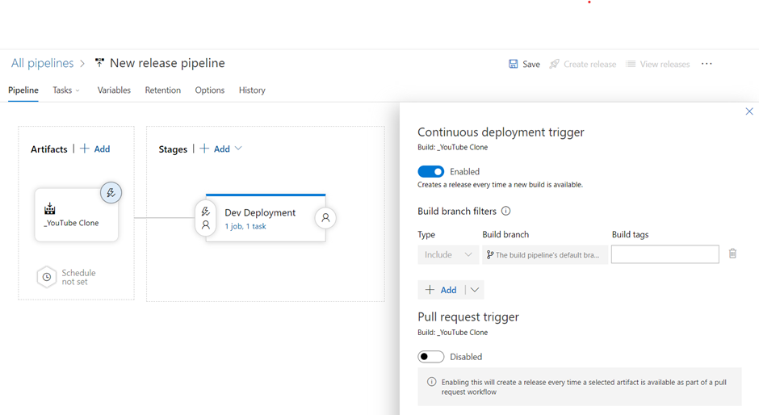
## Adding predeploymnet approval and assinging the approver
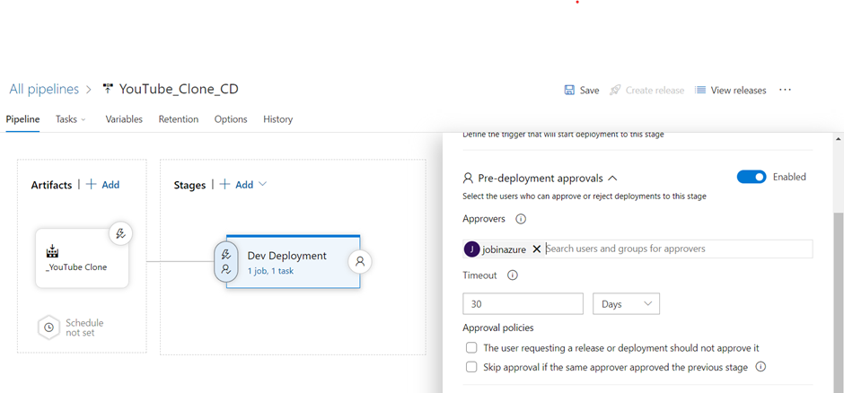
## Adding pre deployment condition
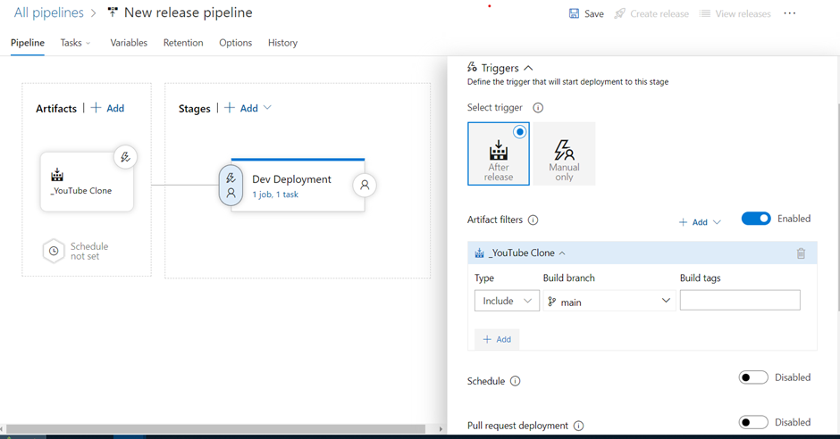
## Creating deployment pipeline
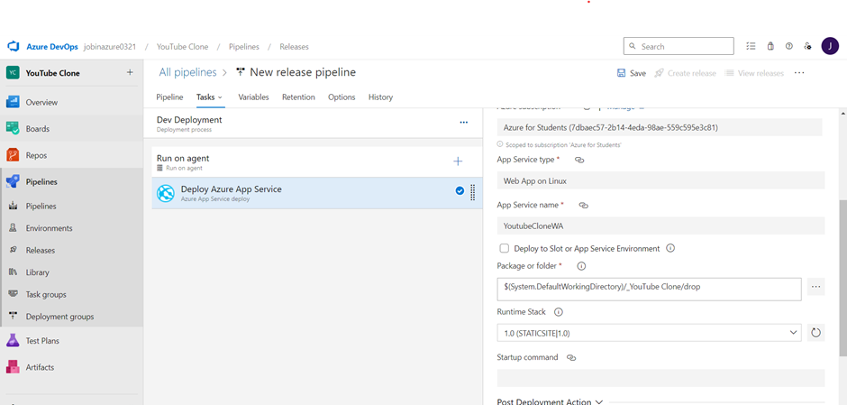
## After triggering the pipeline, the build process has completed successfully
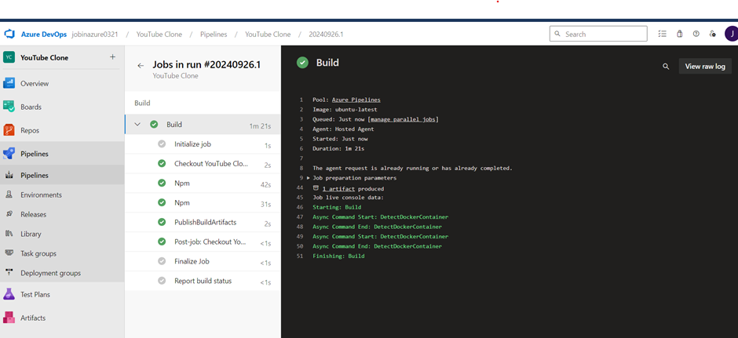
## The release pipeline is currently awaiting approval to proceed
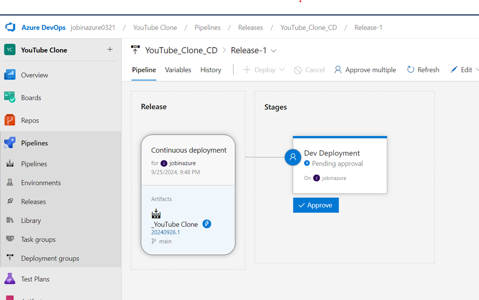
## Approving the deployment
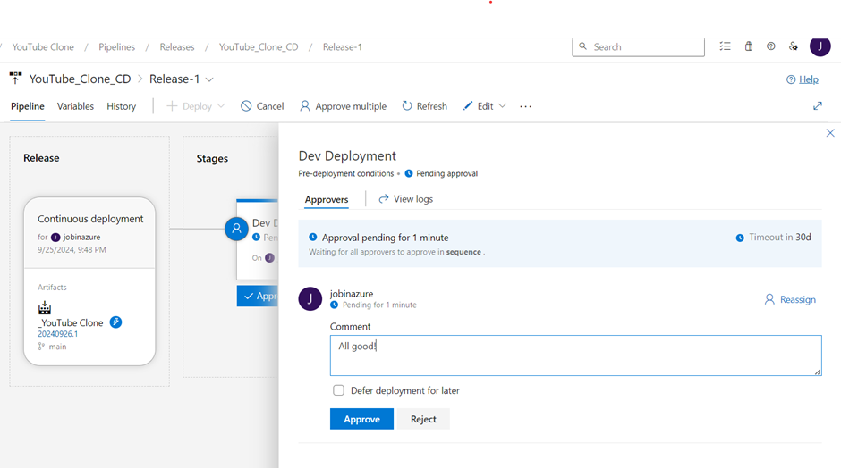
## Continuous deployment has been successfully completed
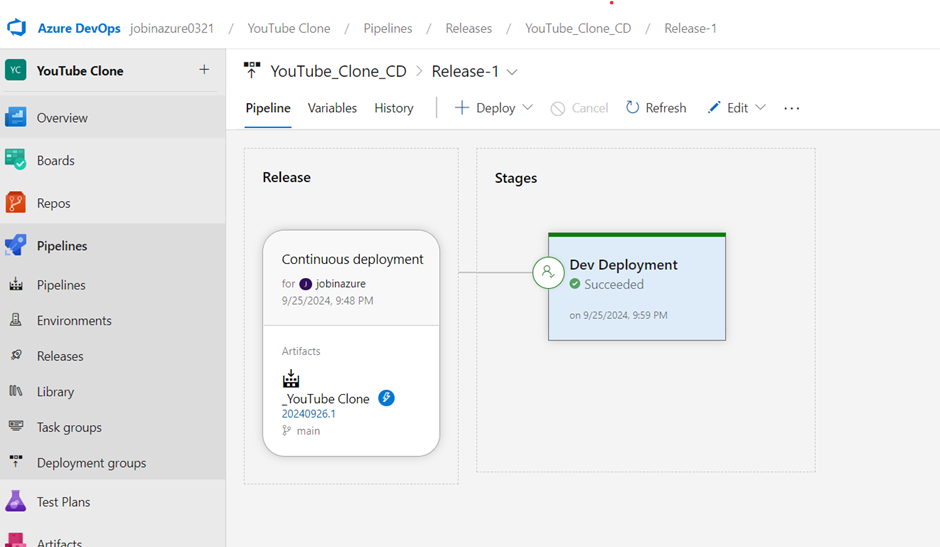
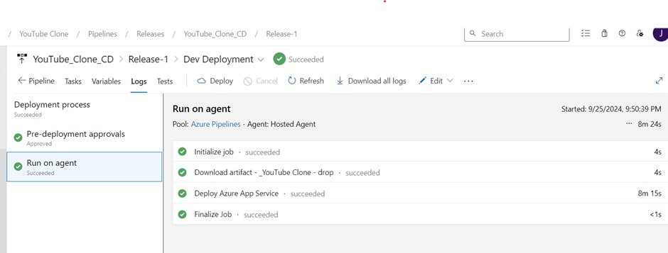
## The YouTube Clone website is now up and running

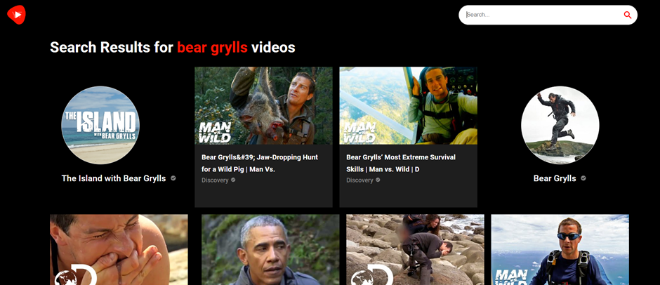

By implementing Azure DevOps CI/CD, this project will demonstrate best practices in automation, enabling rapid iterations, reducing manual intervention, and ensuring that each new feature or fix is automatically tested and deployed to the cloud with minimal downtime. The result is a fully operational, cloud-hosted YouTube clone that follows modern DevOps principles.