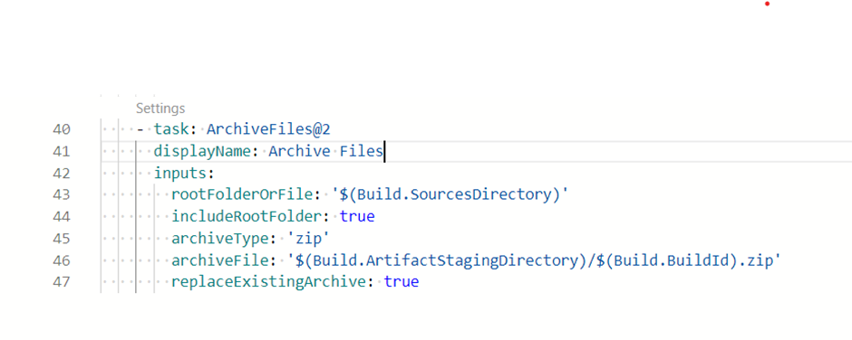
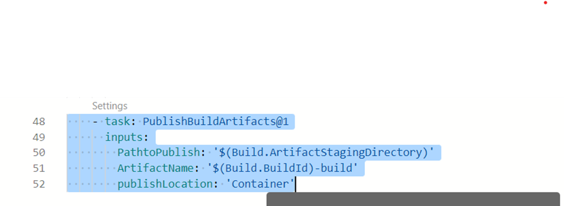
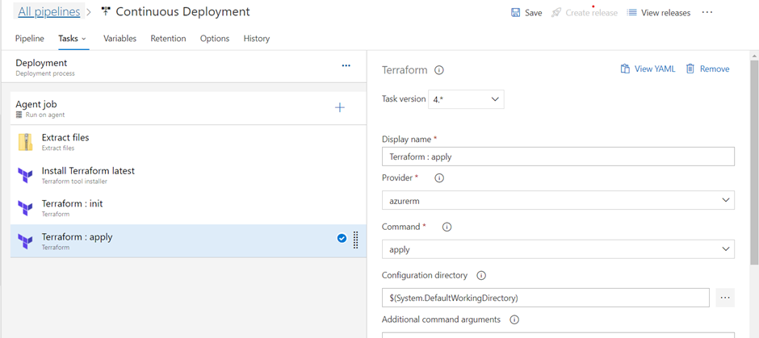
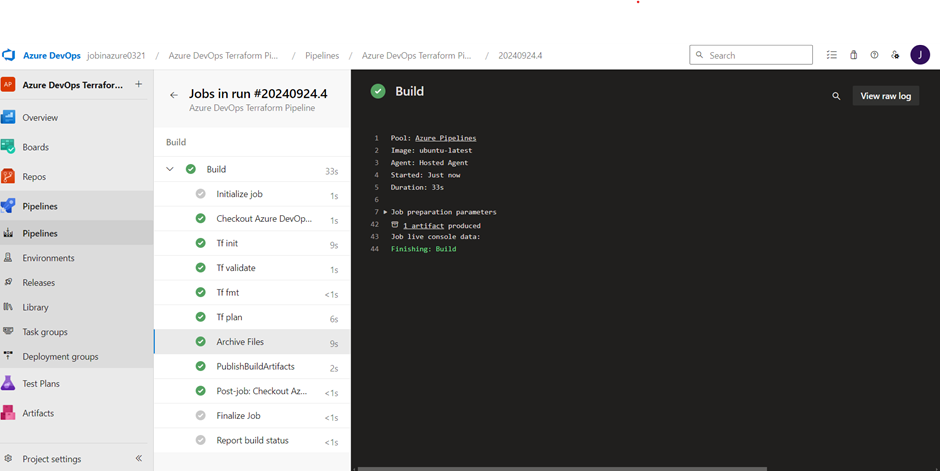

# CI/CD Pipeline for Azure VM Deployment Using Terraform in Azure DevOps
This project aims to automate the deployment of virtual machines (VMs) in Azure by leveraging Azure DevOps and Terraform within a CI/CD pipeline. The pipeline will facilitate the seamless provisioning and management of Azure VMs through Infrastructure as Code (IaC), ensuring consistent and repeatable deployments.
The project will involve creating a Terraform configuration that defines the VM specifications, network settings, and other required resources. Azure DevOps will be utilized to set up the CI/CD pipeline, which will include stages for validating the Terraform code, executing the deployment, and managing any necessary approvals. This automation will not only streamline the deployment process but also improve collaboration among development and operations teams.

## Creating new project in Azure DevOps

## 	Pushing Terraform Files to Azure Git Repository

### Creating terraform.tfvars file

## Creating a Build pipeline on Azure DevOps

## Created storage account for backend process

## Setting Up a Container in the Newly Created Storage Account

## Adding task in build pipeline in YAML : terraform init

##  Adding task in build pipeline in YAML : terraform validate

##  Adding task in build pipeline in YAML : terraform fmt

##  Adding task in build pipeline in YAML : terraform plan

## Archiving the file

## Publishing the Artifact

## Save and Run the build pipeline

## The build pipeline has completed successfully

## Building Release pipeline

## Creating contineous deploymeny pipeline

## Creating destroy stage

## Adding predeployment approval and assigning a approver

## Release pipeline is completed

## Running the build and release pipeline

## The Virtual Machine has been successfully built in Azure portal

# Conclusion
 this project, we successfully automated the deployment of a virtual machine (VM) in Azure using a Continuous Integration/Continuous Deployment (CI/CD) pipeline with Terraform and Azure DevOps. By leveraging Infrastructure as Code (IaC) principles, we ensured consistent and repeatable VM provisioning, which streamlined the deployment process and reduced the potential for manual errors.

The integration of Terraform with Azure DevOps facilitated a seamless workflow, from code updates to deployment, enhancing collaboration between development and operations teams. With the successful creation of the storage account, container, and VM, the project demonstrates the effectiveness of modern DevOps practices in managing cloud infrastructure efficiently.
